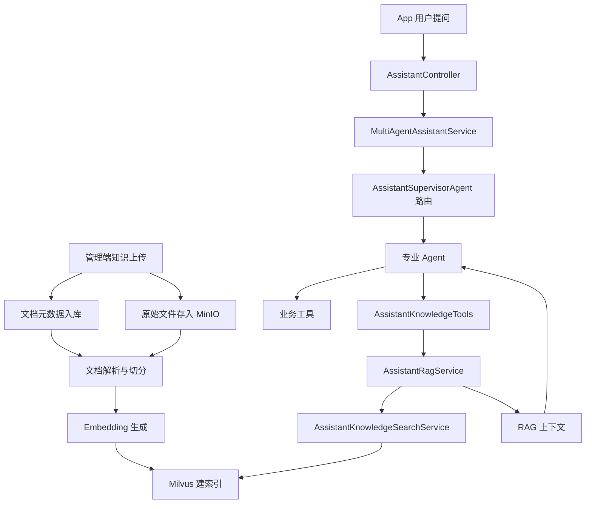

# Lease 助手 RAG 架构设计

## 1. 设计目标

这套 RAG 设计以当前 `lease` 项目的 Spring AI 多 Agent 助手为主，不照搬外部项目，而是吸收参考项目 [SuperBizAgent-release-2026-01-02](C:\Users\ItZhao\Desktop\agent\SuperBizAgent-release-2026-01-02) 已经验证过的分层方式：

- 上传和索引是单独链路
- 检索和问答是单独链路
- Agent 不直接操作 Milvus
- RAG 以工具能力接入助手，而不是塞进一个大而全的 `AiService`

目标不是做一个“什么都懂的知识库机器人”，而是让租房助手在保留现有业务工具能力的前提下，补上下面这类问题：

- 平台规则说明：预约规则、签约流程、取消规则、支付说明
- 房源知识说明：公寓介绍、入住须知、配套规则、看房说明
- 业务 FAQ：押金、租期、月付方式、合同说明、改约说明

一句话概括：

`业务事实走工具，规则说明走 RAG，Supervisor 和多 Agent 结构保持不变。`

## 2. 参考项目到当前项目的映射

参考项目的核心分层是：

- `FileUploadController`
- `DocumentChunkService`
- `VectorEmbeddingService`
- `VectorIndexService`
- `VectorSearchService`
- `RagService`
- `InternalDocsTools`

映射到当前 `lease` 项目后，建议变成：

- 管理端上传入口：`web-admin` 里的知识库上传与管理接口
- 文档切分层：`assistant.service.rag` 下的切分服务
- 向量化层：`assistant.service.rag` 下的 embedding 服务
- 建索引层：`assistant.service.rag` 下的索引服务
- 检索层：`assistant.service.rag` 下的查询服务
- RAG 编排层：`assistant.service.rag` 下的上下文组装服务
- 工具接入层：`assistant.service.tool.AssistantKnowledgeTools`
- 对话编排层：沿用当前 `MultiAgentAssistantService + AssistantSupervisorAgent + 各专业 Agent`

也就是说，当前项目不需要推翻现有多 Agent，只需要把 `RAG` 作为一层新能力接进去。

## 3. 总体分层



## 4. 适合当前项目的职责边界

### 4.1 Controller 层

现有 [AssistantController](F:\code\java\lease\web\web-app\src\main\java\com\atguigu\lease\web\app\assistant\controller\AssistantController.java) 保持薄控制器，不做改造方向上的大手术。

新增的 RAG 入口不建议放在 `web-app`，而建议放在 `web-admin`：

- 上传知识文档
- 删除知识文档
- 触发重建索引
- 查看索引状态

原因很简单：

- App 端用户不应该直接维护知识库
- 知识库属于后台运营内容
- 这样也更符合租房系统的真实使用场景

### 4.2 对话编排层

现有 [MultiAgentAssistantService](F:\code\java\lease\web\web-app\src\main\java\com\atguigu\lease\web\app\assistant\service\chat\MultiAgentAssistantService.java) 和 [AssistantSupervisorAgent](F:\code\java\lease\web\web-app\src\main\java\com\atguigu\lease\web\app\assistant\service\agent\AssistantSupervisorAgent.java) 保持不变。

这里不要把 RAG 做成新的总入口，也不要把 Milvus 调用塞进 Supervisor。

正确做法是：

- Supervisor 继续只负责路由
- 专业 Agent 继续只负责自己的领域回答
- Agent 在需要“说明规则、解释知识”时，通过 `AssistantKnowledgeTools` 调用 RAG

这样能保住你现在最有价值的亮点：

- 多 Agent 还在
- 业务工具还在
- RAG 只是增强，不是推翻

### 4.3 Tool 层

建议新增：

- `AssistantKnowledgeTools`

职责：

- 给模型暴露一个清晰、单一的知识检索工具
- 返回紧凑、结构化、可引用的知识片段
- 不做向量细节，不做 ChatModel 调用

建议工具方法形态：

- `searchKnowledge(String question, String scopeHint, Integer apartmentId, Integer roomId)`

但在第一版里，不要让模型自己填太多参数。

更推荐做法：

- 工具内部从 `toolContext` 和当前 Agent 场景推断用户上下文
- 模型只传入 `question`

这样能避免工具调用参数过多导致模型乱传。

## 5. RAG 层设计

### 5.1 写入链路

写入链路沿用参考项目的思想：

`上传 -> 解析 -> 切分 -> embedding -> Milvus`

建议拆成以下服务：

- `AssistantKnowledgeFileService`
- `AssistantDocumentParseService`
- `AssistantDocumentChunkService`
- `AssistantEmbeddingService`
- `AssistantKnowledgeIndexService`

各自职责：

- `AssistantKnowledgeFileService`
  - 记录文档元数据
  - 管理 MinIO 文件
  - 管理索引状态

- `AssistantDocumentParseService`
  - 负责把 pdf、md、txt、docx 等解析成纯文本
  - 第一版可以先支持 `md/txt/pdf`

- `AssistantDocumentChunkService`
  - 按标题、段落和长度切片
  - 保留 `chunkIndex`、`title`、`source`

- `AssistantEmbeddingService`
  - 封装 Spring AI `EmbeddingModel`
  - 不让上层感知 Ollama / OpenAI / 其他 provider 差异

- `AssistantKnowledgeIndexService`
  - 负责写 Milvus
  - 负责按 `documentId` 删除旧 chunk 再重建
  - 负责索引状态回写数据库

### 5.2 查询链路

查询链路建议拆成：

- `AssistantKnowledgeSearchService`
- `AssistantRagService`

职责：

- `AssistantKnowledgeSearchService`
  - 生成 query embedding
  - 按 metadata 过滤搜索 Milvus
  - 合并多范围结果

- `AssistantRagService`
  - 调用搜索服务
  - 组装引用上下文
  - 返回给工具层或 Agent 层

不要把“向量查询”和“回答生成”写到一个类里。

第一版里，`AssistantRagService` 更适合作为：

- 一个“知识片段装配器”
- 而不是“替代所有 Agent 的统一聊天入口”

## 6. 当前项目最适合的知识范围设计

参考项目用了 `global/personal`。

当前 `lease` 项目更适合改成下面这套 metadata 范围：

- `GLOBAL`
  - 平台通用 FAQ
  - 预约/签约/支付规则
  - 通用租房流程

- `APARTMENT`
  - 公寓介绍
  - 入住须知
  - 配套设施规则

- `ROOM`
  - 特定房间补充说明

- `CITY`
  - 城市差异化政策

第一版不建议一上来做 `USER_PRIVATE`，因为会明显增加管理复杂度。

## 7. 数据模型建议

### 7.1 MySQL 文档元数据表

建议新增表：

- `assistant_knowledge_document`

建议字段：

- `id`
- `title`
- `file_name`
- `bucket`
- `object_key`
- `scope`
- `biz_type`
- `biz_id`
- `status`
- `content_type`
- `file_size`
- `chunk_count`
- `version`
- `last_index_time`
- `remark`
- `create_time`
- `update_time`
- `is_deleted`

说明：

- `scope` 记录范围，例如 `GLOBAL/APARTMENT/ROOM/CITY`
- `biz_type + biz_id` 用来关联业务对象，例如 `APARTMENT + 9`
- `status` 用来区分 `UPLOADED / INDEXING / INDEXED / FAILED`

### 7.2 Milvus Collection

建议用单个 collection：

- `lease_assistant_knowledge`

建议字段：

- `id`
- `document_id`
- `chunk_index`
- `title`
- `content`
- `vector`
- `metadata`

`metadata` 内建议包含：

- `scope`
- `bizType`
- `bizId`
- `fileName`
- `source`
- `version`

这样做好处是：

- 检索逻辑简单
- 后续扩 scope 比较容易
- 不需要为每个公寓建一张 collection

## 8. 和多 Agent 的结合方式

这是当前设计里最关键的点。

### 8.1 不新增总控 Agent

当前不建议为了 RAG 再加一个新的总控层。

原因：

- 你已经有 `Supervisor -> Specialist Agent`
- 再加一层会让链路变重
- RAG 本质上是能力增强，不是新的业务流程编排器

### 8.2 建议的接入方式

第一版建议给以下 Agent 增加 `AssistantKnowledgeTools`：

- `GeneralAssistantAgent`
- `RoomSearchAssistantAgent`
- `AppointmentAssistantAgent`
- `LeaseOrderAssistantAgent`
- `RentalWorkflowAssistantAgent`

调用策略：

- 查房源、查预约、查订单等“结构化事实”优先走原有业务工具
- 遇到“规则解释、流程说明、入住知识、合同说明”时，补充调用知识库工具

一句话就是：

`工具管实时业务，RAG 管半结构化知识解释。`

### 8.3 为什么不做一个独立 KnowledgeAgent

第一版不建议做独立 `KnowledgeAssistantAgent`，原因有三个：

- 当前系统已经有明确路由
- 新加一个知识 Agent 会让路由提示更复杂
- 业务上多数知识问答其实附着在已有场景里

比如：

- 用户问“为什么预约后还能改时间” -> 属于预约 Agent
- 用户问“签约后什么时候生效” -> 属于订单 Agent
- 用户问“这个公寓入住有什么规定” -> 属于找房 Agent 或工作流 Agent

所以第一版更适合“共享知识工具”，不是“新增知识角色”。

如果后期知识问答量非常大，再考虑新建 `KnowledgeAssistantAgent`。

## 9. 推荐的包结构

在当前项目中，建议新增下面这些包：

```text
web/web-app/src/main/java/com/atguigu/lease/web/app/assistant
|- config
|  |- AssistantRagProperties.java
|  `- AssistantMilvusConfiguration.java
|- domain
|  `- rag
|     |- AssistantKnowledgeChunk.java
|     |- AssistantKnowledgeDocument.java
|     `- AssistantKnowledgeSearchResult.java
|- service
|  |- rag
|  |  |- AssistantDocumentParseService.java
|  |  |- AssistantDocumentChunkService.java
|  |  |- AssistantEmbeddingService.java
|  |  |- AssistantKnowledgeIndexService.java
|  |  |- AssistantKnowledgeSearchService.java
|  |  `- AssistantRagService.java
|  `- tool
|     `- AssistantKnowledgeTools.java
```

管理端建议新增：

```text
web/web-admin/src/main/java/com/atguigu/lease/web/admin
|- controller
|  `- AssistantKnowledgeController.java
|- service
|  `- AssistantKnowledgeAdminService.java
|- mapper
|  `- AssistantKnowledgeDocumentMapper.java
```

## 10. 第一版实现边界

为了避免又做得臃肿，第一版建议只做这些：

- 支持 `md/txt/pdf` 上传
- 管理端上传知识文档
- 文档元数据入 MySQL
- 原文件进 MinIO
- 解析、切分、embedding、Milvus 入库
- App 助手通过 `AssistantKnowledgeTools` 检索知识
- 支持 `GLOBAL` 和 `APARTMENT` 两种 scope

第一版先不做：

- 用户私有知识库
- 重排序模型
- 自动摘要写回
- 知识图谱
- 多 collection 分库
- 新的 KnowledgeAgent
- 复杂工作流编排

这部分一定要克制，不然代码很快会胖起来。

## 11. 推荐的实施顺序

### 阶段 1：基础设施接入

- 完成 Milvus 配置
- 增加 RAG 配置类
- 打通 embedding 与 Milvus client

### 阶段 2：写入链路

- 建文档表
- 管理端上传
- MinIO 存文件
- 文档解析和切分
- Milvus 建索引

### 阶段 3：查询链路

- 完成 `AssistantKnowledgeSearchService`
- 完成 `AssistantRagService`
- 完成 `AssistantKnowledgeTools`

### 阶段 4：接入多 Agent

- 优先给 `GeneralAssistantAgent`
- 再给 `AppointmentAssistantAgent`
- 再给 `LeaseOrderAssistantAgent`
- 最后给 `RoomSearchAssistantAgent` 和 `RentalWorkflowAssistantAgent`

### 阶段 5：验证

- 上传一份平台 FAQ
- 上传一份公寓入住说明
- 在 Attu 中确认数据入库
- 在助手中验证“规则问答”和“房源规则说明”是否能命中

## 12. 面试和项目表达方式

这个架构最好讲的一点是：

- 我没有把 RAG 直接塞进聊天服务
- 而是把它拆成上传索引链路和查询增强链路
- 再通过知识工具接到现有多 Agent 助手里

你可以这样讲：

`我沿用了 Spring AI 分层助手架构，在现有 Supervisor + Specialist Agent 的基础上补了一层独立 RAG 能力，把知识上传、切分、向量化、检索和上下文装配拆开实现，再通过共享知识工具接入不同业务 Agent，这样既保留了多 Agent 的可解释性，也避免把 RAG、工具调用和业务逻辑揉进一个巨大的 AI Service。`

## 13. 最终建议

对当前 `lease` 项目来说，最合适的不是“做一个独立知识问答机器人”，而是：

- 保留你现在的多 Agent
- 保留现有业务工具
- 新增一套轻量、清晰、可维护的 RAG 层
- 让 RAG 专门负责规则解释和知识补充

这才是最稳、最好讲、也最不容易臃肿的实现方式。
