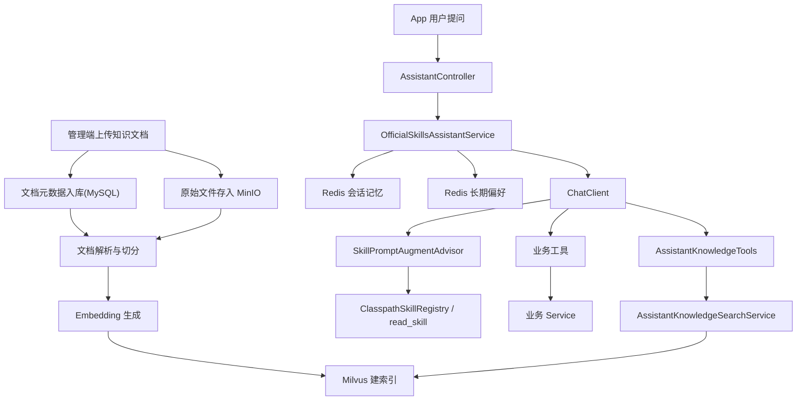

# Lease 助手 RAG 架构设计

## 1. 设计目标

当前 `lease` 项目的助手已经不是早期的多 Agent 路由方案，而是基于 `Spring AI + Spring AI Alibaba Skills` 的轻量实现：

- 对话入口由 `OfficialSkillsAssistantService` 统一承接
- 规则选择由 `SkillPromptAugmentAdvisor + ClasspathSkillRegistry` 完成
- 业务事实通过工具调用获取
- 说明性问题通过 `AssistantKnowledgeTools + RAG` 获取知识片段
- 会话记忆和长期偏好分别落在 Redis

这套设计的目标不是堆更多 AI 抽象，而是把租房业务里的三类能力拆开：

- 实时业务查询与动作：走业务工具
- 平台规则与 FAQ：走知识检索
- 会话上下文与用户偏好：走 Redis 记忆

一句话概括：

`业务事实走工具，规则说明走 RAG，Skills 负责补充场景规则。`

## 2. 总体分层

## 3. 当前实现里的职责边界

### 3.1 App 端对话入口

- [AssistantController](F:\code\java\lease\web\web-app\src\main\java\com\atguigu\lease\web\app\assistant\controller\AssistantController.java)
  - 只负责接收 `/app/assistant/chat` 和 `/app/assistant/chat/stream`
  - 不承担提示词、工具编排、RAG 逻辑

- [OfficialSkillsAssistantService](F:\code\java\lease\web\web-app\src\main\java\com\atguigu\lease\web\app\assistant\service\chat\OfficialSkillsAssistantService.java)
  - 统一编排普通对话和 SSE 流式对话
  - 读取短期会话历史
  - 读取并沉淀长期偏好
  - 调用 `ChatClient`
  - 透传工具事件到前端 SSE

### 3.2 Skills 层

- [AssistantSkillsConfiguration](F:\code\java\lease\web\web-app\src\main\java\com\atguigu\lease\web\app\assistant\config\AssistantSkillsConfiguration.java)
  - 装配 `ClasspathSkillRegistry`
  - 装配 `SkillPromptAugmentAdvisor`
  - 暴露 `read_skill` 工具

- `src/main/resources/skills`
  - `house-search`
  - `appointment-service`
  - `lease-order`
  - `knowledge-qa`

这里的职责很明确：

- `SKILL.md` 只负责场景规则和调用建议
- 真实业务执行仍由 Java 工具类完成
- 不再手写意图路由器和 Supervisor

### 3.3 工具层

当前工具层按业务域拆分：

- `AssistantRoomTools`
- `AssistantAppointmentTools`
- `AssistantLeaseOrderTools`
- `AssistantBrowsingHistoryTools`
- `AssistantKnowledgeTools`

工具层的职责是：

- 接收模型参数
- 调用现有业务 Service
- 返回统一的 `AssistantToolResult`
- 在流式对话中输出 `tool_call / tool_result` 事件

这意味着助手不是“直接查数据库”，而是复用现有业务主链路。

## 4. RAG 读写链路

### 4.1 知识写入链路

管理端知识库链路位于 `web-admin`：

- 上传文件
- 解析文档
- 切分 chunk
- 生成 embedding
- 写入 Milvus
- 回写 MySQL 状态

核心实现集中在：

- [AssistantKnowledgeServiceImpl](F:\code\java\lease\web\web-admin\src\main\java\com\atguigu\lease\web\admin\service\impl\AssistantKnowledgeServiceImpl.java)

这条链路把：

- 原文件放在 MinIO
- 元数据和状态放在 MySQL
- 向量索引放在 Milvus

索引失败时会记录状态和错误信息，支持后续 `reindex`，不需要重新上传原文件。

### 4.2 知识查询链路

App 端知识查询链路是：

- `AssistantKnowledgeTools.searchKnowledge`
- `AssistantKnowledgeSearchService`
- `MilvusAssistantKnowledgeSearchService`

它的职责不是直接生成答案，而是：

- 根据问题生成向量
- 从 Milvus 检索相关片段
- 返回精简、可复用的知识结果

然后由模型在当前对话上下文中组织最终回答。

## 5. 会话、记忆与时间语义

### 5.1 短期会话记忆

- [RedisAssistantConversationSessionService](F:\code\java\lease\web\web-app\src\main\java\com\atguigu\lease\web\app\assistant\service\session\RedisAssistantConversationSessionService.java)
  - 保存一轮轮用户/助手对话
  - 控制历史条数和 TTL

### 5.2 长期偏好记忆

- [RedisAssistantLongTermMemoryService](F:\code\java\lease\web\web-app\src\main\java\com\atguigu\lease\web\app\assistant\service\memory\RedisAssistantLongTermMemoryService.java)
  - 从用户消息里提取预算、区域、入住时间、支付偏好
  - 生成精简的记忆提示词

### 5.3 时间解析策略

- [AssistantDateTimeParser](F:\code\java\lease\web\web-app\src\main\java\com\atguigu\lease\web\app\assistant\service\tool\AssistantDateTimeParser.java)
  - 固定使用 `Asia/Shanghai`
  - 仅支持项目真实需要的时间格式
  - 不再接受通用 ISO instant / offset 输入

当前推荐模型在调用工具前优先归一化为：

- `yyyy-MM-dd HH:mm:ss`
- `yyyy-MM-dd`

这样可以减少工具层解析分支，保持助手实现轻量。

## 6. 面试讲解口径

可以用下面这段话来讲：

> 我把助手拆成了四层：对话编排、Skills 规则层、业务工具层和 RAG 检索层。
> 实时业务问题，比如查房源、查预约、查订单，统一走现有业务工具；规则说明类问题，比如预约规则、订单超时、签约流程，则走知识库检索。
> 这样做的好处是代码量可控，业务边界清晰，既避免把所有逻辑揉进一个巨大的 AI Service，也比早期手写路由更轻、更容易维护。
