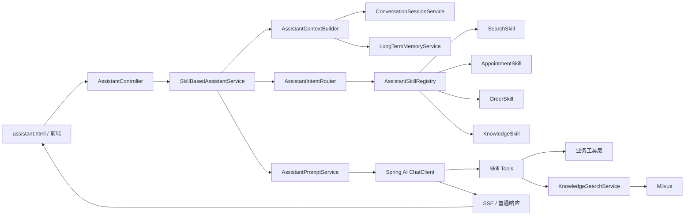
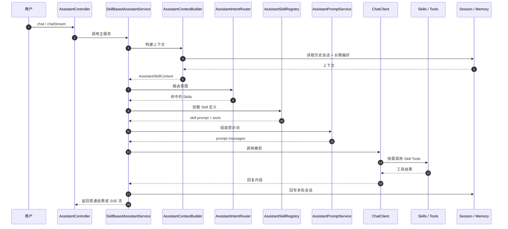
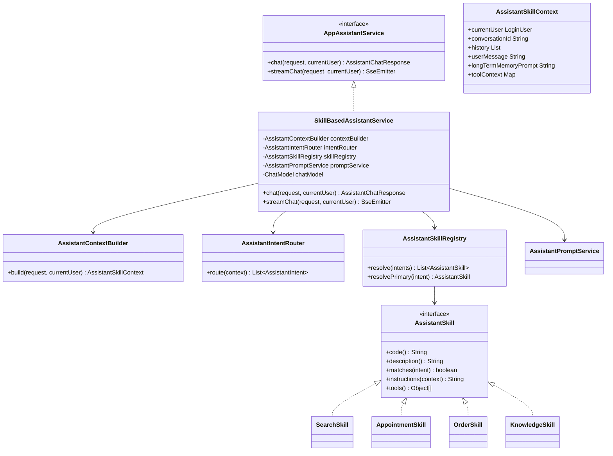

# 助手重构设计稿：从多 Agent 收敛到 Skills

## 1. 设计目标

这次重构不是推倒重来，而是只替换助手的编排层。

保留的部分：

- `AssistantController`
- 会话记忆与长期偏好记忆
- 工具层
- RAG 检索层
- SSE 流式输出

收敛的部分：

- `Supervisor + SpecialistAgent` 重构为 `IntentRouter + Skills`

目标效果：

- 减少无关提示词注入
- 降低工具误调用概率
- 降低类之间的耦合
- 让架构更像“一个主助手 + 多个能力模块”

---

## 2. 目标架构图



这套结构里，主入口还是 `AssistantController -> AppAssistantService`，但是服务实现从 `MultiAgentAssistantService` 变成 `SkillBasedAssistantService`。

---

## 3. 运行时序



---

## 4. 包结构建议

```text
assistant
├─ config
├─ controller
├─ dto
├─ service
│  ├─ chat
│  │  ├─ AppAssistantService.java
│  │  ├─ SkillBasedAssistantService.java
│  │  ├─ AssistantContextBuilder.java
│  │  └─ AssistantPromptService.java
│  ├─ routing
│  │  ├─ AssistantIntentRouter.java
│  │  ├─ AssistantIntent.java
│  │  └─ AssistantIntentRule.java
│  ├─ skill
│  │  ├─ AssistantSkill.java
│  │  ├─ AssistantSkillContext.java
│  │  ├─ AssistantSkillDescriptor.java
│  │  ├─ AssistantSkillRegistry.java
│  │  ├─ SearchSkill.java
│  │  ├─ AppointmentSkill.java
│  │  ├─ OrderSkill.java
│  │  └─ KnowledgeSkill.java
│  ├─ memory
│  ├─ rag
│  ├─ session
│  └─ tool
```

---

## 5. 核心类图



---

## 6. 方法签名草案

### 6.1 主服务入口

`AppAssistantService` 接口可以不改，保持兼容：

```java
public interface AppAssistantService {

    AssistantChatResponse chat(AssistantChatRequest request, LoginUser currentUser);

    SseEmitter streamChat(AssistantChatRequest request, LoginUser currentUser);
}
```

新的实现类：

```java
public class SkillBasedAssistantService implements AppAssistantService {

    public AssistantChatResponse chat(AssistantChatRequest request, LoginUser currentUser);

    public SseEmitter streamChat(AssistantChatRequest request, LoginUser currentUser);

    protected AssistantChatResponse doChat(AssistantSkillContext context, boolean streaming);

    protected List<AssistantSkill> resolveSkills(AssistantSkillContext context);

    protected List<Message> buildPromptMessages(
            AssistantSkillContext context,
            List<AssistantSkill> activeSkills
    );
}
```

### 6.2 上下文构建器

```java
public class AssistantContextBuilder {

    public AssistantSkillContext build(AssistantChatRequest request, LoginUser currentUser);

    protected String resolveConversationId(AssistantChatRequest request, LoginUser currentUser);

    protected List<AssistantConversationMessage> loadHistory(Long userId, String conversationId);

    protected String buildLongTermMemoryPrompt(Long userId, String userMessage);

    protected Map<String, Object> buildToolContext(Long userId, String conversationId);
}
```

建议上下文对象设计成 `record` 或普通 POJO：

```java
public record AssistantSkillContext(
        LoginUser currentUser,
        String conversationId,
        List<AssistantConversationMessage> history,
        String userMessage,
        String longTermMemoryPrompt,
        Map<String, Object> toolContext
) {
}
```

### 6.3 意图路由

先做轻量路由，不做复杂 planner：

```java
public interface AssistantIntentRouter {

    List<AssistantIntent> route(AssistantSkillContext context);
}
```

意图枚举建议这样收口：

```java
public enum AssistantIntent {
    SEARCH,
    APPOINTMENT,
    ORDER,
    KNOWLEDGE
}
```

默认实现：

```java
public class DefaultAssistantIntentRouter implements AssistantIntentRouter {

    public List<AssistantIntent> route(AssistantSkillContext context);

    protected List<AssistantIntent> routeByRules(String userMessage);

    protected List<AssistantIntent> routeByModel(AssistantSkillContext context);

    protected List<AssistantIntent> mergeRuleAndModelResult(
            List<AssistantIntent> ruleResult,
            List<AssistantIntent> modelResult
    );
}
```

说明：

- 规则优先
- 模型辅助
- 最终只返回 1~2 个 skill，避免 prompt 重新膨胀

### 6.4 Skill 接口

建议统一成一个极简接口：

```java
public interface AssistantSkill {

    String code();

    String description();

    boolean matches(AssistantIntent intent);

    String instructions(AssistantSkillContext context);

    Object[] tools();
}
```

如果你想把元数据和实现分开，也可以：

```java
public record AssistantSkillDescriptor(
        String code,
        String description,
        List<AssistantIntent> intents
) {
}
```

### 6.5 Skill 注册中心

```java
public class AssistantSkillRegistry {

    public AssistantSkillRegistry(List<AssistantSkill> skills);

    public List<AssistantSkill> resolve(List<AssistantIntent> intents);

    public AssistantSkill resolvePrimary(AssistantIntent intent);

    public List<AssistantSkill> allSkills();
}
```

### 6.6 四个 Skills

#### SearchSkill

```java
public class SearchSkill implements AssistantSkill {

    public String code();

    public String description();

    public boolean matches(AssistantIntent intent);

    public String instructions(AssistantSkillContext context);

    public Object[] tools();
}
```

工具建议：

- `AssistantApartmentTools`
- `AssistantRoomTools`
- `AssistantBrowsingHistoryTools`

#### AppointmentSkill

```java
public class AppointmentSkill implements AssistantSkill {

    public String code();

    public String description();

    public boolean matches(AssistantIntent intent);

    public String instructions(AssistantSkillContext context);

    public Object[] tools();
}
```

工具建议：

- `AssistantAppointmentTools`
- 必要时补 `AssistantApartmentTools`

#### OrderSkill

```java
public class OrderSkill implements AssistantSkill {

    public String code();

    public String description();

    public boolean matches(AssistantIntent intent);

    public String instructions(AssistantSkillContext context);

    public Object[] tools();
}
```

工具建议：

- `AssistantLeaseOrderTools`
- 必要时补 `AssistantRoomTools`

#### KnowledgeSkill

```java
public class KnowledgeSkill implements AssistantSkill {

    public String code();

    public String description();

    public boolean matches(AssistantIntent intent);

    public String instructions(AssistantSkillContext context);

    public Object[] tools();
}
```

工具建议：

- `AssistantKnowledgeTools`

### 6.7 Prompt 组装

现有 `AssistantPromptService` 可以保留，但建议加一个按 skills 组装的方法：

```java
public class AssistantPromptService {

    public List<Message> buildPromptMessages(
            LoginUser currentUser,
            List<AssistantConversationMessage> history,
            String userMessage,
            String extraInstructions
    );

    public String buildBaseSystemPrompt(LoginUser currentUser);

    public String mergeSkillInstructions(List<AssistantSkill> skills, AssistantSkillContext context);
}
```

这里的关键变化是：

- 以前是 `基础提示 + 专员提示 + 长期记忆`
- 以后变成 `基础提示 + 激活 skills 的提示 + 长期记忆`

---

## 7. 旧结构到新结构的映射

### 保留

- `AssistantController`
- `AssistantPromptService`
- `RedisAssistantConversationSessionService`
- `RedisAssistantLongTermMemoryService`
- 所有 `Assistant*Tools`
- `MilvusAssistantKnowledgeSearchService`

### 替换

旧类：

- `MultiAgentAssistantService`
- `AssistantSupervisorAgent`
- `SearchQaAssistantAgent`
- `BusinessExecutionAssistantAgent`

新类：

- `SkillBasedAssistantService`
- `DefaultAssistantIntentRouter`
- `SearchSkill`
- `AppointmentSkill`
- `OrderSkill`
- `KnowledgeSkill`

### 对照关系

- `SearchQaAssistantAgent` -> `SearchSkill + KnowledgeSkill`
- `BusinessExecutionAssistantAgent` -> `AppointmentSkill + OrderSkill`
- `AssistantSupervisorAgent` -> `DefaultAssistantIntentRouter`

---

## 8. 配置层改造建议

`AssistantConfiguration` 需要从装配 `MultiAgentAssistantService` 改为装配 `SkillBasedAssistantService`。

草案如下：

```java
@Bean
@ConditionalOnMissingBean(AppAssistantService.class)
public AppAssistantService appAssistantService(
        ObjectProvider<ChatModel> chatModelProvider,
        AssistantPromptService promptService,
        AssistantConversationSessionService conversationSessionService,
        AssistantLongTermMemoryService longTermMemoryService,
        AssistantProperties assistantProperties,
        AssistantSkillRegistry skillRegistry,
        AssistantIntentRouter intentRouter
) {
    ChatModel chatModel = chatModelProvider.getIfAvailable();
    if (assistantProperties.isEnabled() && chatModel != null) {
        return new SkillBasedAssistantService(
                chatModel,
                promptService,
                new AssistantContextBuilder(
                        conversationSessionService,
                        longTermMemoryService
                ),
                intentRouter,
                skillRegistry,
                assistantProperties
        );
    }
    return new DisabledAssistantService(promptService);
}
```

---

## 9. 最稳的迁移顺序

### 第一步

先新增这些类，不删旧代码：

- `AssistantIntent`
- `AssistantIntentRouter`
- `DefaultAssistantIntentRouter`
- `AssistantSkill`
- `AssistantSkillContext`
- `AssistantSkillRegistry`
- `SearchSkill`
- `AppointmentSkill`
- `OrderSkill`
- `KnowledgeSkill`

### 第二步

新增 `SkillBasedAssistantService`，先让它能跑通：

- history
- longTermMemory
- routing
- skill prompt
- ChatClient
- SSE

### 第三步

在 `AssistantConfiguration` 里切换主实现，保留旧类一段时间用于回滚。

### 第四步

新链路稳定后再删除：

- `AssistantSupervisorAgent`
- `SearchQaAssistantAgent`
- `BusinessExecutionAssistantAgent`

---

## 10. 面试表达

可以直接这么说：

> 我把原来的多 Agent 编排进一步收敛成了 skill-based assistant。主助手只负责上下文构建、意图路由和模型调用，具体能力拆成房源检索、预约处理、订单处理、知识问答四个 skills，并按需注入对应提示词和工具。这样减少了无关提示词注入，降低了误调用概率，也让架构更轻、更容易维护。

---

## 11. 一句话结论

这次重构的本质，不是把助手做得更复杂，而是把原来“角色型多 Agent”收敛成“能力型 Skills”，让它更像一个工程系统，而不是一个堆满 prompt 的 AI 演示功能。

