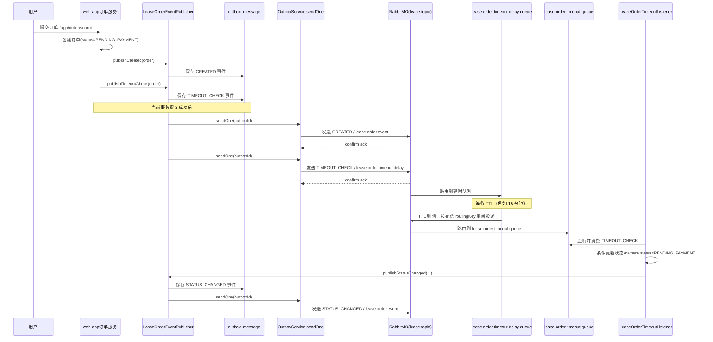

# 面试版：订单 RabbitMQ 链路

## 1. 一句话概括

这个项目里，RabbitMQ 主要用于**订单领域事件异步广播**和**待支付订单超时自动取消**，并通过 **Outbox 模式**保证消息可靠登记与最终投递。

---

## 2. 先讲清楚链路

订单链路可以拆成 8 步：

1. 用户调用 `/app/order/submit` 提交订单。
2. `web-app` 创建一笔 `PENDING_PAYMENT` 状态的订单，并写入 `lease_order`。
3. 下单成功后，业务层会发布两类事件：
   - `CREATED`：普通订单创建事件
   - `TIMEOUT_CHECK`：未来超时检查事件
4. 这两类事件都不会直接裸发 MQ，而是先转换成 `OutboxMessage` 并写入 `outbox_message`。
5. 当前数据库事务提交成功后，`OutboxServiceImpl#sendOne` 才会真正调用 `RabbitTemplate` 发消息。
6. 普通事件走 `lease.order.event`，进入 `lease.order.audit.queue`。
7. 超时检查事件走 `lease.order.timeout.delay`，进入延时队列，等待 TTL 到期后通过死信机制转发到 `lease.order.timeout.queue`。
8. `LeaseOrderTimeoutListener` 消费超时消息，做条件更新：只有订单当前仍是 `PENDING_PAYMENT`，才会改成 `TIMEOUT_CANCELED`，然后再补发一条 `STATUS_CHANGED` 事件。

---

## 3. 时序图



---

## 4. 数据流动图

这张图重点看“数据”怎么流，不只看“调用关系”。

```mermaid
flowchart LR
    A["前端下单请求"] --> B["LeaseOrderController"]
    B --> C["LeaseOrderServiceImpl"]
    C --> D["lease_order 表<br/>写入订单(PENDING_PAYMENT)"]

    C --> E["LeaseOrderEventPublisher"]
    E --> F["OutboxMessage"]
    F --> G["outbox_message 表<br/>保存 CREATED / TIMEOUT_CHECK"]

    G --> H["OutboxServiceImpl#sendOne"]
    H --> I["RabbitTemplate"]
    I --> J["exchange: lease.topic"]

    J --> K["routingKey: lease.order.event"]
    K --> L["queue: lease.order.audit.queue"]

    J --> M["routingKey: lease.order.timeout.delay"]
    M --> N["queue: lease.order.timeout.delay.queue"]
    N --> O["TTL 到期 + 死信转发"]
    O --> P["routingKey: lease.order.timeout"]
    P --> Q["queue: lease.order.timeout.queue"]

    Q --> R["LeaseOrderTimeoutListener"]
    R --> S["lease_order 表<br/>条件更新为 TIMEOUT_CANCELED"]
    R --> T["再次发布 STATUS_CHANGED"]
    T --> F
```



---

## 5. 关键点怎么讲

### 5.1 为什么要发两类消息

- `CREATED`：告诉下游“订单创建成功了”
- `TIMEOUT_CHECK`：预约一个未来的超时检查动作

### 5.2 为什么普通事件也走 Outbox

因为普通事件和超时事件本质上都是领域事件，都需要保证：

- 业务数据成功时，消息已经可靠登记
- 如果 MQ 当场失败，后续还能补发

所以不区分“普通事件裸发、超时事件走 outbox”，而是统一可靠投递标准。

### 5.3 为什么 TTL 到期后不会误取消已支付订单

因为超时消费者不是无脑更新，而是执行条件更新：

```sql
update lease_order
set status = TIMEOUT_CANCELED
where id = ?
  and status = PENDING_PAYMENT
```

如果用户已经支付，状态已经不是 `PENDING_PAYMENT`，那更新就会跳过。

### 5.4 `RabbitTemplate` 在这条链路里的作用

`RabbitTemplate` 是真正发消息的工具，负责：

- 把 Java 对象转换成 JSON 消息
- 发往 exchange + routing key
- 通过 `ConfirmCallback` 观察消息是否到达 exchange
- 通过 `ReturnsCallback` 观察消息是否成功路由到 queue

---

## 6. 面试背诵版

### 6.1 30 秒版

这个项目里订单 RabbitMQ 链路主要用于异步事件传播和超时自动关单。用户下单后，系统会先创建一笔 `PENDING_PAYMENT` 的订单，然后发布 `CREATED` 和 `TIMEOUT_CHECK` 两类事件。事件不会直接裸发 MQ，而是先通过 Outbox 模式写入 `outbox_message`，事务提交后再由 `sendOne` 真正发送。普通事件走 `lease.order.event`，超时事件走 `lease.order.timeout.delay` 进入延时队列，TTL 到期后通过死信转发到 `lease.order.timeout.queue`，最后由超时监听器做条件更新，把仍未支付的订单改成 `TIMEOUT_CANCELED`。

### 6.2 1 分钟版

这个项目里 RabbitMQ 在订单链路主要承担两类职责：一类是订单创建、支付、取消等普通事件的异步广播，另一类是待支付订单的超时自动取消。实现上采用了 Outbox 模式，业务层在创建订单后，会通过 `LeaseOrderEventPublisher` 先把 `CREATED` 和 `TIMEOUT_CHECK` 事件转换成 `OutboxMessage` 写入 `outbox_message`，保证业务数据和待发送消息在同一事务里成功。事务提交后，再由 `OutboxServiceImpl#sendOne` 使用 `RabbitTemplate` 真正把消息发到 `lease.topic`。普通事件通过 `lease.order.event` 路由到审计队列，超时消息通过 `lease.order.timeout.delay` 进入带 TTL 的延时队列，超时后借助死信机制转发到 `lease.order.timeout.queue`，由 `LeaseOrderTimeoutListener` 消费。消费者会执行条件更新，只有订单当前仍然是 `PENDING_PAYMENT` 才会改成 `TIMEOUT_CANCELED`，这样可以避免支付和超时并发场景下的误取消。处理成功后，还会再发布一条 `STATUS_CHANGED` 事件，形成完整的异步状态流转闭环。

---

## 7. 面试时建议强调的亮点

- 不是直接裸发 MQ，而是走 **Outbox + afterCommit**，保证业务数据和消息登记的一致性。
- 普通事件和超时事件统一走可靠投递链路，可靠性标准一致。
- 使用 **TTL + 死信队列** 实现延时处理，不需要手工扫表。
- 超时消费者采用 **条件更新**，避免支付和超时并发时误关单。
- 超时处理成功后会继续发布 `STATUS_CHANGED`，形成闭环事件流。

