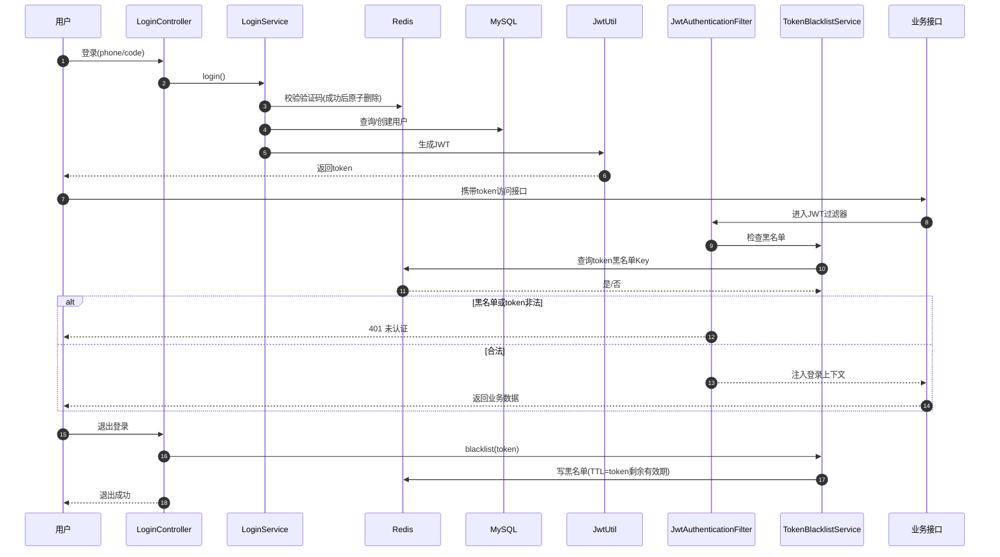
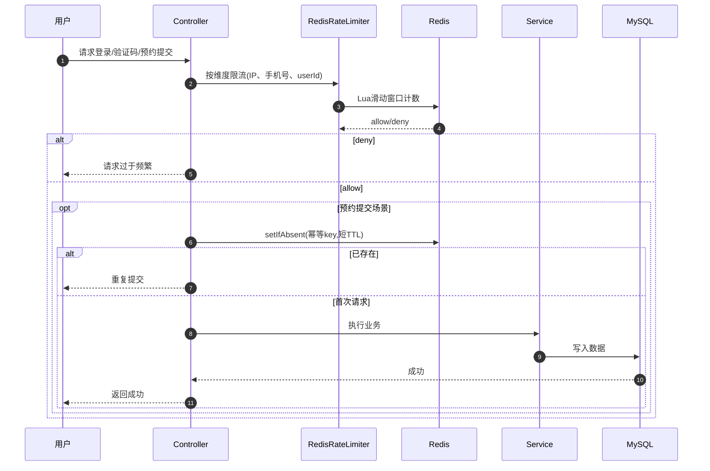
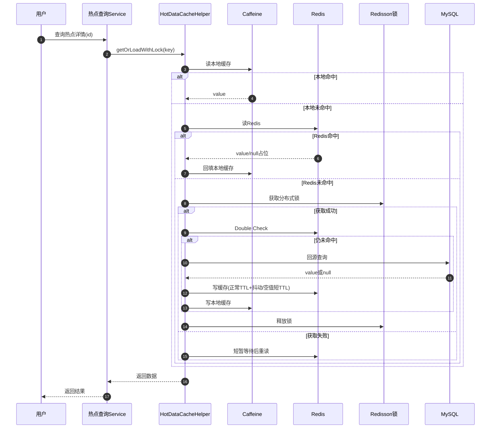
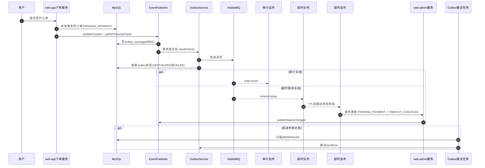
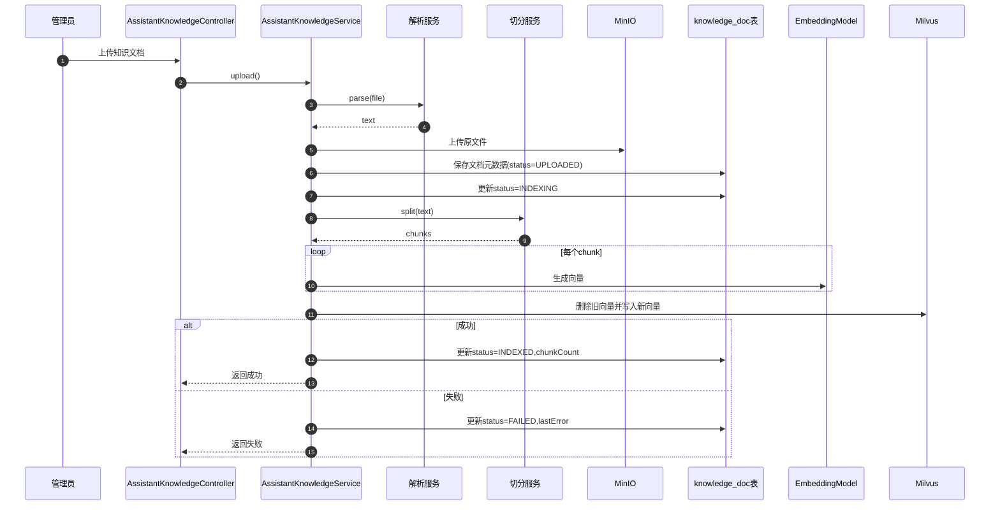
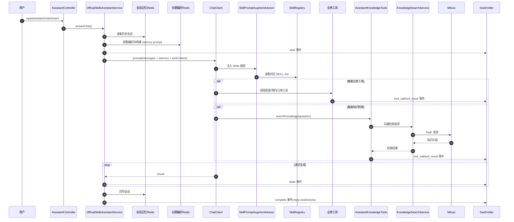

# 智慧公寓项目时序图（面试版）

这份文档按项目的 6 个核心能力拆分，每个模块包含：
1. 一张精简但可讲清楚的时序图
2. 一段面试讲解口径（30~60 秒）

---

## 1. 认证鉴权（Spring Security + JWT + Redis）

**讲解口径**
登录阶段用短信验证码换 JWT，访问阶段通过过滤器做 token 解析和黑名单校验。退出登录时不改 JWT 本身，而是把 token 哈希写入 Redis 黑名单并设置剩余 TTL，这样实现无状态登录下的主动失效控制。

---

## 2. 访问防护（限流 + 幂等防重复）

**讲解口径**
入口层先做 Redis 滑动窗口限流，预约提交再补一层短窗口幂等键，防止双击和重试造成重复写入。这样能同时覆盖恶意高频请求和正常用户误操作两类风险。

---

## 3. 缓存治理（Caffeine + Redis + 空值缓存 + TTL抖动 + Redisson锁）

**讲解口径**
这块是典型“多层缓存 + 并发保护”方案：Caffeine 抗短时热点、Redis 做共享缓存、空值缓存防穿透、TTL 抖动防雪崩、Redisson 锁防击穿。核心是把高并发时的 DB 回源收敛到极少量请求。

---

## 4. 可靠消息（RabbitMQ + Outbox + TTL + 死信）

**讲解口径**
消息不直接发 MQ，而是先落 Outbox，事务提交后异步投递，保证“业务写库成功后消息最终可达”。TTL + 死信用于超时自动取消订单，避免待支付订单长期占用资源。

---

## 5. 对象存储与知识入库（MinIO + 解析切分 + Embedding + Milvus）

**讲解口径**
这条链路把“文档上传”和“向量入库”打通：原文件入 MinIO，结构化状态落 MySQL，向量落 Milvus。索引失败会记录 `lastError`，支持后续按文档重建索引，不需要重新上传文件。

---

## 6. 智能助手（Spring AI Skills + 工具 + RAG + SSE）

**讲解口径**
当前助手不再依赖手写多 Agent 路由，而是用 `ChatClient + SkillPromptAugmentAdvisor + Skills` 选择场景规则。实时业务问题走工具，规则说明类问题走知识检索，前端通过 SSE 接收 `start / delta / tool_call / tool_result / complete` 事件。这样既保留了业务可解释性，也把代码量控制在比较轻的范围内。

---

## 面试建议（怎么用这份图）

1. 先选 2 个你最强的模块重点讲，比如“缓存治理 + 可靠消息”。  
2. 其余模块用“目标-方案-结果”三句话过。  
3. 图只讲主干路径，异常分支挑一个最关键的说（如索引失败可重试、MQ失败有Outbox补偿）。
