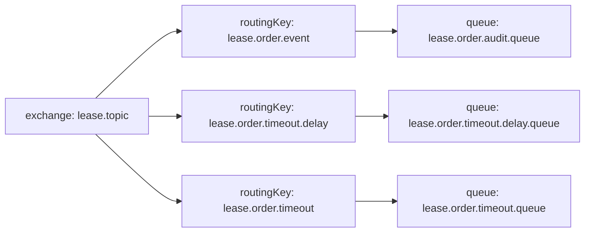
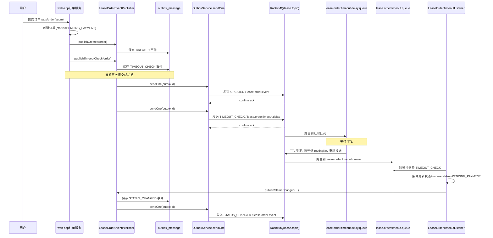

# RabbitMQ 订单链路说明

## 1. 这份文档讲什么

这份文档只讲项目里和**订单链路**相关的 RabbitMQ 流程，重点包括：

- 下单后为什么会发两类消息
- 为什么普通事件和超时事件都要先落 `outbox_message`
- `RabbitTemplate` 在哪里真正把消息发出去
- 延时队列、TTL、死信、超时消费者是怎么串起来的
- 为什么超时取消不会误伤已支付订单

相关核心代码：

- `web/web-app/src/main/java/com/atguigu/lease/web/app/controller/order/LeaseOrderController.java`
- `web/web-app/src/main/java/com/atguigu/lease/web/app/service/impl/LeaseOrderServiceImpl.java`
- `common/src/main/java/com/atguigu/lease/common/mq/publisher/LeaseOrderEventPublisher.java`
- `common/src/main/java/com/atguigu/lease/common/mq/outbox/service/impl/OutboxServiceImpl.java`
- `common/src/main/java/com/atguigu/lease/common/mq/RabbitMqConfiguration.java`
- `web/web-admin/src/main/java/com/atguigu/lease/web/admin/mq/LeaseOrderTimeoutListener.java`

---

## 2. RabbitMQ 在订单链路里的职责

RabbitMQ 在订单链路里主要承担两类职责：

### 2.1 普通订单事件异步广播

例如：

- 订单创建成功
- 订单支付成功
- 订单手动取消
- 订单超时取消后状态变更

这类事件会走：

- `exchange`: `lease.topic`
- `routingKey`: `lease.order.event`
- `queue`: `lease.order.audit.queue`

当前主要用于异步审计和日志观察，后续也可以继续扩展成通知、风控、同步等下游能力。

### 2.2 订单超时自动取消

下单后系统不会立即取消订单，而是会先发一条 `TIMEOUT_CHECK` 消息到延时队列：

- `routingKey`: `lease.order.timeout.delay`
- `queue`: `lease.order.timeout.delay.queue`

消息会在延时队列里等待 TTL，到期后通过死信机制转发到：

- `routingKey`: `lease.order.timeout`
- `queue`: `lease.order.timeout.queue`

最后由超时消费者处理，执行条件更新，把仍然处于 `PENDING_PAYMENT` 的订单改为 `TIMEOUT_CANCELED`。

---

## 3. MQ 基础拓扑

订单链路相关常量定义在：

- `common/src/main/java/com/atguigu/lease/common/mq/LeaseMqConstants.java`

关键名字如下：

- 交换机：`lease.topic`
- 普通事件路由键：`lease.order.event`
- 延时事件路由键：`lease.order.timeout.delay`
- 超时事件路由键：`lease.order.timeout`
- 普通事件队列：`lease.order.audit.queue`
- 延时队列：`lease.order.timeout.delay.queue`
- 超时消费队列：`lease.order.timeout.queue`

可以把它记成下面这张小图：



---

## 4. 为什么要先走 Outbox

项目里不是业务代码直接裸发 MQ，而是统一先写 `outbox_message`。

原因是：

1. 要保证业务数据和待发送消息在一个事务里成功
2. 如果 MQ 当场发送失败，后面还能补发
3. 普通事件和超时事件都遵循同一套可靠投递标准

所以项目真正追求的不是：

> 订单事务提交时，MQ 必须当场成功发出去

而是：

> 订单事务提交成功时，对应消息必须已经可靠登记到 `outbox_message`

这就是 Outbox 模式的核心边界。

---

## 5. 下单主链路

### 5.1 Controller 入口

用户下单入口在：

- `POST /app/order/submit`

对应：

- `LeaseOrderController#submit`

Controller 的作用很薄：

- 接收参数
- 获取当前登录用户
- 调用 `LeaseOrderService.submit(...)`

### 5.2 Service 创建订单

`LeaseOrderServiceImpl#submit(...)` 里会完成这些事：

1. 校验参数
2. 查询用户、房间、租期、支付方式
3. 加房间锁，避免并发重复下单
4. 构造订单对象
5. 设置状态为 `PENDING_PAYMENT`
6. 设置 `expireTime`
7. 插入 `lease_order`

### 5.3 下单后发两类消息

订单插入后，会调用：

- `publishCreated(order)`
- `publishTimeoutCheck(...)`

也就是说，下单成功后不是发一条消息，而是发两条：

#### 普通事件：`CREATED`

语义是：

> 有一笔订单创建成功了

#### 延时事件：`TIMEOUT_CHECK`

语义是：

> 请在未来检查这笔订单是否仍未支付，如果仍未支付就改成超时取消

---

## 6. `LeaseOrderEventPublisher` 做了什么

`LeaseOrderEventPublisher` 是订单领域事件发布器。

它负责两件事：

1. 把业务动作封装成 `LeaseOrderEvent`
2. 把事件转换成 `OutboxMessage` 并落库

### 6.1 普通事件和延时事件的区别

- `publishCreated(...)`
- `publishStatusChanged(...)`

这两类最终走默认普通事件路由键：

- `lease.order.event`

而：

- `publishTimeoutCheck(...)`

会显式指定：

- `lease.order.timeout.delay`

所以两者真正的区别只在 **routing key 不同**，并不在“是否走 outbox”上。

### 6.2 为什么 `buildOutbox(...)` 要转 JSON

`LeaseOrderEvent` 是 JVM 内存里的 Java 对象，数据库表不能直接存 Java 对象实例。

所以 `buildOutbox(...)` 会把事件转成：

- `payloadType`
- `payload(JSON)`

例如：

```java
outbox.setPayloadType(LeaseOrderEvent.class.getName());
outbox.setPayload(objectMapper.writeValueAsString(event));
```

目的就是把“未来要发送的消息”完整、可恢复地保存到数据库里。

### 6.3 为什么 outbox 入库失败要直接抛错

现在订单事件发布器的语义是：

- `outbox` 落库成功：主事务可以继续
- `outbox` 落库失败：主事务直接失败回滚

这样能保证：

> 不会出现订单已经创建成功，但核心消息没有可靠登记的情况

---

## 7. `OutboxServiceImpl#sendOne` 做了什么

`sendOne(outboxId)` 才是真正发 MQ 的地方。

它的流程可以概括成：

1. 根据 `outboxId` 查出一条 `outbox_message`
2. 只处理状态为 `NEW` 或 `FAILED` 的记录
3. 把 `payload` 里的 JSON 反序列化回 Java 对象
4. 创建 `CorrelationData`
5. 调 `rabbitTemplate.convertAndSend(...)` 真正发消息
6. 先把状态标记为 `SENT`
7. 等待 broker confirm
8. 成功则标记为 `ACKED`
9. 失败则标记为 `FAILED`

这里的 `CorrelationData` 可以理解成这条消息的“回执追踪 id”，项目里通常用 `outboxId` 作为它的值，便于把 MQ 确认结果和 outbox 记录对上。

---

## 8. `RabbitMqConfiguration` 做了什么

这个配置类定义了整个订单链路的 MQ 基础设施：

### 8.1 统一交换机

- `lease.topic`

### 8.2 订单普通事件队列

- `lease.order.audit.queue`

绑定：

- `lease.order.event`

### 8.3 订单延时队列

- `lease.order.timeout.delay.queue`

这个队列配置了：

- `x-message-ttl`
- `x-dead-letter-exchange`
- `x-dead-letter-routing-key`

作用是：

> 消息先在这里等待 TTL，到期后自动按死信 routing key 重新投递

### 8.4 订单超时消费队列

- `lease.order.timeout.queue`

绑定：

- `lease.order.timeout`

它是 TTL 到期后真正给消费者消费的队列。

### 8.5 `RabbitTemplate`

项目里统一配置了：

- JSON 消息转换器
- `mandatory=true`
- `ConfirmCallback`
- `ReturnsCallback`

这几项分别负责：

- 把 Java 对象转成 JSON
- 路由失败时不要静默丢失
- 确认消息是否到达 exchange
- 确认消息是否成功路由到队列

---

## 9. 订单超时自动取消链路

这一段是整个 RabbitMQ 订单链路里最关键的业务流程。

### 9.1 下单后发延时消息

`publishTimeoutCheck(...)` 会构造一条 `TIMEOUT_CHECK` 事件，并发往：

- `lease.order.timeout.delay`

消息进入：

- `lease.order.timeout.delay.queue`

### 9.2 延时队列等待 TTL

这条消息不会立即被消费，而是在延时队列中等待。

### 9.3 TTL 到期后变成死信

因为延时队列配置了：

- `x-dead-letter-exchange = lease.topic`
- `x-dead-letter-routing-key = lease.order.timeout`

所以消息到期后会被重新投递到：

- `lease.topic`
- `lease.order.timeout`

然后被路由到：

- `lease.order.timeout.queue`

### 9.4 超时消费者处理

`LeaseOrderTimeoutListener` 会一直监听：

- `lease.order.timeout.queue`

收到消息后，它不会无脑取消订单，而是会做条件更新：

```sql
update lease_order
set status = TIMEOUT_CANCELED
where id = ?
  and status = PENDING_PAYMENT
```

这一步非常关键，因为它保证了：

- 如果用户已经支付成功
- 当前状态已经不是 `PENDING_PAYMENT`
- 那超时消息就不会误取消订单

### 9.5 更新成功后补发状态变更事件

如果超时取消成功，监听器还会再发布一条：

- `STATUS_CHANGED`

这样普通事件链路也能感知到这次状态变化。

---

## 10. 订单 RabbitMQ 总时序图



---

## 11. 为什么这条链路设计得比较稳

这条链路有几个比较重要的工程点：

### 11.1 Outbox 保证可靠登记

订单主事务成功时，对应消息也必须成功登记到 `outbox_message`。

### 11.2 afterCommit 避免脏消息

只有事务提交成功后才真正发 MQ，避免数据库没提交但消息先发出的不一致问题。

### 11.3 TTL + 死信实现延时处理

不需要手工扫表，也不用业务线程自己等待时间。

### 11.4 条件更新避免误取消

即使用户支付和超时消息并发发生，也不会把已支付订单误关掉。

### 11.5 失败可重试

只要消息已经写进 `outbox_message`，后续就可以靠重试任务继续补发。

---

## 12. 面试背诵版

### 12.1 30 秒版

这个项目里订单 RabbitMQ 链路主要用于异步事件传播和超时自动关单。用户下单后，系统会先创建一笔 `PENDING_PAYMENT` 订单，然后通过 `LeaseOrderEventPublisher` 生成 `CREATED` 和 `TIMEOUT_CHECK` 两类事件。事件不会直接裸发 RabbitMQ，而是先通过 Outbox 模式写入 `outbox_message`，事务提交后再由 `sendOne` 真正发送。普通事件走 `lease.order.event`，超时事件走 `lease.order.timeout.delay` 进入延时队列，TTL 到期后通过死信转发到 `lease.order.timeout.queue`，最后由超时监听器做条件更新，把仍未支付的订单改成 `TIMEOUT_CANCELED`。

### 12.2 1 分钟版

这个项目里 RabbitMQ 在订单链路主要承担两类职责：一类是订单创建、支付、取消等普通事件的异步广播，另一类是待支付订单的超时自动取消。实现上采用了 Outbox 模式，业务层在创建订单后，会通过 `LeaseOrderEventPublisher` 先把 `CREATED` 和 `TIMEOUT_CHECK` 事件转换成 `OutboxMessage` 写入 `outbox_message`，保证业务数据和待发送消息在同一事务里成功。事务提交后，再由 `OutboxService.sendOne` 使用 `RabbitTemplate` 真正把消息发到 `lease.topic`。普通事件通过 `lease.order.event` 路由到审计队列，超时消息通过 `lease.order.timeout.delay` 进入带 TTL 的延时队列，超时后借助死信机制转发到 `lease.order.timeout.queue`，由 `LeaseOrderTimeoutListener` 消费。消费者会执行条件更新，只有订单当前仍然是 `PENDING_PAYMENT` 才会改成 `TIMEOUT_CANCELED`，这样可以避免支付和超时并发场景下的误取消。处理成功后，还会再发布一条 `STATUS_CHANGED` 事件，形成完整的异步状态流转闭环。

